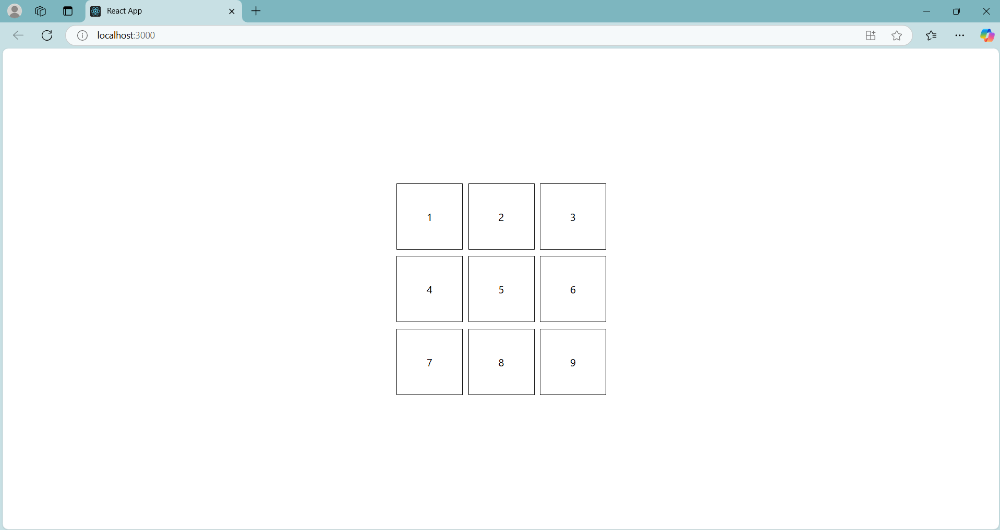

# Clickable Matrix

This is a simple React app that creates a **3x3 clickable matrix**. The functionality is as follows:

- Clicking on any box changes its color to **green**.
- Clicking on the **last box (bottom-right corner)** will change all clicked boxes to **orange** in the sequence they were originally clicked.

## Demo Screenshot

## Working Demo

[▶Watch Demo](./src/working/clickable%20matrix.mp4)

## Features

- 3x3 grid
- Green highlight on click
- Sequential orange color transition when last box is clicked
- Smooth UX with delay-based transitions

